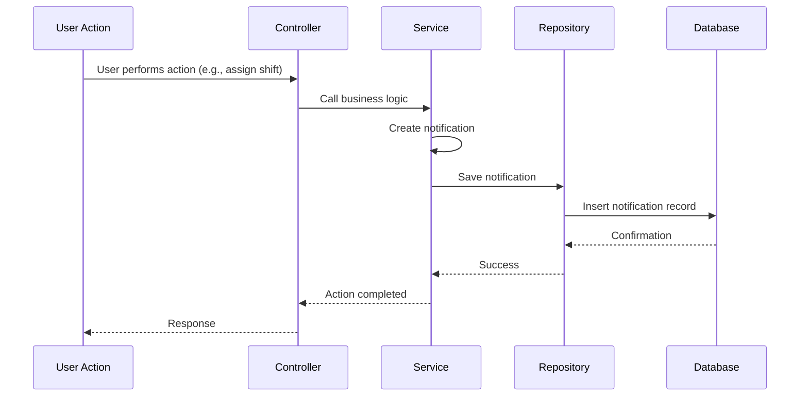
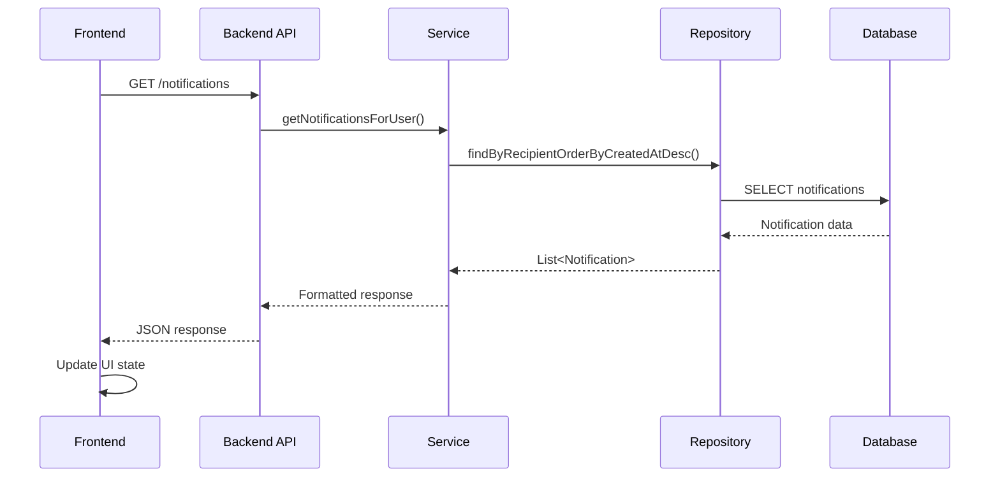
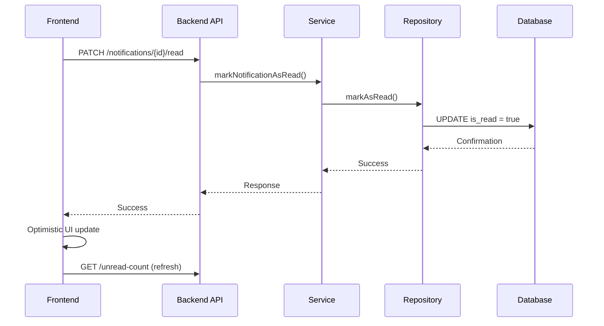

# We-Roster Notification System Design

## Overview

The We-Roster notification system is a comprehensive real-time communication system designed to keep healthcare staff informed about important events, approvals, and requests within the roster management system. The system provides both backend and frontend components that work together to deliver timely, relevant notifications to users.

## Architecture

### System Components

```
┌─────────────────┐    ┌─────────────────┐    ┌─────────────────┐
│   Frontend      │    │   Backend       │    │   Database      │
│                 │    │                 │    │                 │
│ • React Native  │◄──►│ • Spring Boot   │◄──►│ • MySQL         │
│ • Context API   │    │ • REST API      │    │ • JPA/Hibernate │
│ • Hooks         │    │ • Service Layer │    │ • Notifications │
│ • Components    │    │ • Repository    │    │   Table         │
└─────────────────┘    └─────────────────┘    └─────────────────┘
```

## Database Design

### Notification Table Schema

```sql
CREATE TABLE notification (
    id BIGINT AUTO_INCREMENT PRIMARY KEY,
    recipient_id BIGINT NOT NULL,
    type VARCHAR(50) NOT NULL,
    title VARCHAR(200) NOT NULL,
    message TEXT NOT NULL,
    is_read BOOLEAN NOT NULL DEFAULT FALSE,
    created_at DATETIME NOT NULL DEFAULT CURRENT_TIMESTAMP,
    read_at DATETIME NULL,
    related_entity_type VARCHAR(50),
    related_entity_id BIGINT,
    triggered_by_id BIGINT,
    
    CONSTRAINT fk_notification_recipient FOREIGN KEY (recipient_id) REFERENCES Users(id),
    CONSTRAINT fk_notification_triggered_by FOREIGN KEY (triggered_by_id) REFERENCES Users(id)
);
```

### Key Relationships

- **recipient_id**: Links to `Users` table - who receives the notification
- **triggered_by_id**: Links to `Users` table - who triggered the notification
- **related_entity_type/related_entity_id**: Generic reference to related business entities

## Backend Implementation

### Core Components

#### 1. Notification Entity (`Notification.java`)

```java
@Entity
@Table(name = "notification")
public class Notification {
    @Id
    @GeneratedValue(strategy = GenerationType.IDENTITY)
    private Long id;
    
    @ManyToOne(fetch = FetchType.LAZY)
    @JoinColumn(name = "recipient_id", nullable = false)
    private User recipient;
    
    @Column(name = "type", nullable = false, length = 50)
    private String type;
    
    @Column(name = "title", nullable = false, length = 200)
    private String title;
    
    @Column(name = "message", columnDefinition = "TEXT", nullable = false)
    private String message;
    
    @Column(name = "is_read", nullable = false)
    private Boolean isRead = false;
    
    @Column(name = "created_at", nullable = false)
    private LocalDateTime createdAt = LocalDateTime.now();
    
    @Column(name = "read_at")
    private LocalDateTime readAt;
    
    @Column(name = "related_entity_type", length = 50)
    private String relatedEntityType;
    
    @Column(name = "related_entity_id")
    private Long relatedEntityId;
    
    @ManyToOne(fetch = FetchType.LAZY)
    @JoinColumn(name = "triggered_by_id")
    private User triggeredBy;
}
```

#### 2. Notification Types

The system supports the following notification types:

- **EVENT_ASSIGNMENT**: When a shift is assigned to a staff member
- **LEAVE_APPROVAL**: When a leave request is approved
- **LEAVE_DECLINED**: When a leave request is declined
- **SWAP_REQUEST**: When someone requests to swap shifts
- **SWAP_APPROVED**: When a swap request is approved
- **SWAP_DECLINED**: When a swap request is declined
- **OPEN_SHIFT_APPROVED**: When an open shift application is approved
- **OPEN_SHIFT_DECLINED**: When an open shift application is declined
- **LEAVE_SWAP_REQUEST**: When someone wants to swap for your shift

#### 3. NotificationService

The service layer handles notification creation and management:

```java
@Service
@Transactional
public class NotificationService {
    
    // Create specific notification types
    public void createEventAssignmentNotification(ShiftAssignment assignment, Staff assignedBy);
    public void createLeaveApprovalNotification(LeaveRequest leaveRequest, Staff approvedBy);
    public void createSwapRequestNotification(ShiftSwap swapRequest);
    // ... other notification creation methods
    
    // Generic notification management
    public List<Notification> getNotificationsForUser(Long userId, int limit, int offset);
    public long getUnreadCountForUser(Long userId);
    public boolean markNotificationAsRead(Long notificationId, Long userId);
    public int markAllNotificationsAsRead(Long userId);
}
```

#### 4. REST API Endpoints

```http
GET    /api/v1/notifications              # Get notifications with pagination
GET    /api/v1/notifications/unread-count # Get unread count
PATCH  /api/v1/notifications/{id}/read    # Mark notification as read
PATCH  /api/v1/notifications/mark-all-read # Mark all notifications as read
```

## Frontend Implementation

### Core Components

#### 1. NotificationContext

Centralized state management for notifications:

```typescript
interface NotificationContextType {
  unreadCount: number;
  refreshUnreadCount: () => Promise<void>;
  isLoading: boolean;
  markAsRead: (notificationId: string) => Promise<void>;
}

export function NotificationProvider({ children, autoRefresh = true, refreshInterval = 30000 }) {
  const [unreadCount, setUnreadCount] = useState<number>(0);
  const [isLoading, setIsLoading] = useState<boolean>(false);
  
  // Auto-refresh every 30 seconds
  // Optimistic updates for better UX
  // Error handling and retry logic
}
```

#### 2. NotificationBell Component

Visual indicator for unread notifications:

```typescript
export default function NotificationBell({
  onPress,
  unreadCount = 0,
  size = 24,
  color = "#fff",
}) {
  const hasUnread = unreadCount > 0;
  
  return (
    <Pressable onPress={onPress}>
      <Ionicons name="notifications-outline" size={size} color={color} />
      {hasUnread && (
        <View style={badgeStyle}>
          <Text>{unreadCount > 99 ? "99+" : unreadCount}</Text>
        </View>
      )}
    </Pressable>
  );
}
```

#### 3. Notifications Screen

Full notification management interface:

```typescript
export default function NotificationsScreen() {
  const { notifications, loading, error, markAsRead, markAllAsRead } = useNotifications();
  const { refreshUnreadCount } = useNotificationContext();
  
  // Features:
  // - Paginated notification list
  // - Filter by type (Direct/Overall)
  // - Mark as read functionality
  // - Pull-to-refresh
  // - Empty and error states
}
```

#### 4. useNotifications Hook

Custom hook for notification management:

```typescript
export function useNotifications(opts: Options = {}) {
  const [notifications, setNotifications] = useState<Notification[]>([]);
  const [loading, setLoading] = useState<boolean>(true);
  const [unreadCount, setUnreadCount] = useState<number>(0);
  
  // Features:
  // - Pagination support
  // - Filter management
  // - Optimistic updates
  // - Auto-refresh capability
  // - Error handling
}
```

## Notification Flow

### 1. Notification Creation



### 2. Notification Retrieval



### 3. Mark as Read Flow



## Key Features

### 1. Real-time Updates
- Auto-refresh every 30 seconds
- Optimistic updates for immediate feedback
- Background synchronization

### 2. User Experience
- Visual badge with unread count
- Pull-to-refresh functionality
- Filter by notification type
- Mark all as read option

### 3. Performance Optimizations
- Pagination for large notification lists
- Lazy loading of notification details
- Efficient database queries with proper indexing
- Caching of unread counts

### 4. Error Handling
- Graceful degradation on API failures
- Retry mechanisms for failed requests
- Offline state management
- User-friendly error messages

## Security Considerations

### 1. Access Control
- User can only access their own notifications
- Validation of notification ownership before marking as read
- Proper authentication and authorization

### 2. Data Privacy
- No sensitive information in notification messages
- Proper data sanitization
- Audit trail for notification actions

## Scalability Considerations

### 1. Database Optimization
- Proper indexing on frequently queried columns
- Pagination to handle large datasets
- Cleanup of old notifications

### 2. Performance
- Efficient queries with proper joins
- Caching strategies for unread counts
- Background processing for notification creation

### 3. Future Enhancements
- Push notifications for mobile devices
- Email notifications for critical events
- Notification preferences and settings
- Real-time WebSocket connections

## Configuration

### Environment Variables

```bash
# Notification settings
NOTIFICATION_AUTO_REFRESH_INTERVAL=30000  # 30 seconds
NOTIFICATION_PAGE_SIZE=20                 # Default page size
NOTIFICATION_CLEANUP_DAYS=90              # Keep notifications for 90 days
```

### Frontend Configuration

```typescript
// NotificationContext configuration
<NotificationProvider 
  autoRefresh={true} 
  refreshInterval={30000}
>
  {children}
</NotificationProvider>
```

## Testing Strategy

### 1. Unit Tests
- Notification service methods
- Repository queries
- Frontend hooks and components

### 2. Integration Tests
- API endpoint functionality
- Database operations
- End-to-end notification flows

### 3. Performance Tests
- Large dataset handling
- Concurrent user scenarios
- Memory usage optimization

## Monitoring and Logging

### 1. Metrics
- Notification creation rate
- Read/unread ratios
- API response times
- Error rates

### 2. Logging
- Notification creation events
- User interaction logs
- Error tracking
- Performance monitoring

## Future Roadmap

### Phase 1: Enhanced Features
- [ ] Push notifications for mobile
- [ ] Email notifications
- [ ] Notification preferences
- [ ] Rich media support

### Phase 2: Advanced Functionality
- [ ] Real-time WebSocket connections
- [ ] Notification templates
- [ ] Bulk operations
- [ ] Advanced filtering

### Phase 3: Analytics and Insights
- [ ] Notification engagement metrics
- [ ] User behavior analysis
- [ ] Performance dashboards
- [ ] A/B testing framework

## How the Notification System Works

### Current Implementation Status

The notification system is **partially implemented** with the following status:

#### ✅ **Completed Components:**
- **Backend Infrastructure**: Full notification service, repository, entity, and controller
- **Database Schema**: Complete notification table with all relationships
- **Frontend Components**: Notification context, bell component, and notifications screen
- **API Endpoints**: All CRUD operations for notifications
- **Integration Points**: Leave requests, swap requests, and shift assignments

#### ⚠️ **Partially Implemented:**
- **Open Shift Notifications**: Service methods exist but not yet integrated into OpenShiftController

#### 🔄 **Current Workflow Examples:**

**1. Leave Request Notifications:**
```
User submits leave request → LeaveController processes → NotificationService.createLeaveApprovalNotification() → Notification saved to database → Frontend polls for updates
```

**2. Swap Request Notifications:**
```
User requests swap → SwapController processes → NotificationService.createSwapRequestNotification() → Target user receives notification → Frontend displays in notification bell
```

**3. Open Shift Application (Future Implementation):**
```
User applies for open shift → OpenShiftController processes → [PENDING] NotificationService.createOpenShiftApprovalNotification() → Admin approves/declines → Notification sent to applicant
```

### Integration Points

#### **Controllers with Active Notifications:**

1. **LeaveController** - ✅ Active
   - Creates notifications when leave requests are approved/declined
   - Uses: `notificationService.createLeaveApprovalNotification()`

2. **SwapController** - ✅ Active  
   - Creates notifications for swap requests, approvals, and declines
   - Uses: `notificationService.createSwapRequestNotification()`

3. **ShiftAssignmentController** - ✅ Active
   - Creates notifications when shifts are assigned
   - Uses: `notificationService.createEventAssignmentNotification()`

4. **OpenShiftController** - ⚠️ Ready but Not Integrated
   - Service methods exist but controller doesn't use them yet
   - Will use: `notificationService.createOpenShiftApprovalNotification()`

### Real-World Usage Flow

#### **For Healthcare Staff:**

1. **Receiving Notifications:**
   - Staff member opens the app
   - NotificationContext automatically fetches unread count
   - Red badge appears on notification bell if unread notifications exist
   - User taps bell to see notification list
   - Notifications show with timestamp, type, and message

2. **Responding to Notifications:**
   - User sees "Swap Request" notification
   - Taps notification to navigate to swap details
   - Approves or declines the swap
   - System creates new notification for the requester

3. **Managing Notifications:**
   - User can mark individual notifications as read
   - "Mark all as read" option available
   - Notifications persist for 90 days (configurable)

#### **For Managers/Admins:**

1. **Approving Requests:**
   - Manager receives notifications about pending requests
   - Reviews request details through the app
   - Approves or declines the request
   - System automatically notifies the applicant

2. **Assignment Management:**
   - When assigning shifts, managers can see who's available
   - Assignment creates immediate notification for assigned staff
   - Staff receive notification about their new shift

### Technical Implementation Details

#### **Backend Processing:**

```java
// Example: Leave approval creates notification
@PostMapping("/approve/{leaveId}")
public ResponseEntity<?> approveLeave(@PathVariable Long leaveId, @RequestParam String managerEmail) {
    // 1. Update leave request status
    leaveRequest.setStatus("APPROVED");
    leaveRequestRepository.save(leaveRequest);
    
    // 2. Create notification for staff member
    Staff manager = findStaffByUserEmail(managerEmail);
    notificationService.createLeaveApprovalNotification(leaveRequest, manager);
    
    // 3. Return success response
    return ResponseEntity.ok("Leave approved successfully");
}
```

#### **Frontend Polling:**

```typescript
// NotificationContext automatically polls for updates
useEffect(() => {
  const interval = setInterval(() => {
    fetchUnreadCount(); // GET /api/v1/notifications/unread-count
  }, 30000); // Every 30 seconds
  
  return () => clearInterval(interval);
}, []);
```

#### **Database Queries:**

```sql
-- Get unread notifications for user
SELECT * FROM notification 
WHERE recipient_id = ? AND is_read = FALSE 
ORDER BY created_at DESC;

-- Mark notification as read
UPDATE notification 
SET is_read = TRUE, read_at = NOW() 
WHERE id = ? AND recipient_id = ?;
```

### Performance Considerations

#### **Optimization Strategies:**

1. **Pagination**: Notifications are loaded in pages of 20 items
2. **Lazy Loading**: Only load notifications when user opens the screen
3. **Caching**: Unread count is cached and refreshed periodically
4. **Background Sync**: Notifications sync in background every 30 seconds

#### **Database Indexing:**

```sql
-- Optimized indexes for performance
CREATE INDEX idx_notification_recipient_read ON notification(recipient_id, is_read);
CREATE INDEX idx_notification_created_at ON notification(created_at DESC);
CREATE INDEX idx_notification_related_entity ON notification(related_entity_type, related_entity_id);
```

### Error Handling and Resilience

#### **Backend Error Handling:**

- Notification creation failures don't block main operations
- Failed notifications are logged but don't crash the system
- Retry mechanisms for temporary failures

#### **Frontend Error Handling:**

- Graceful degradation when notification service is unavailable
- Offline state management
- Retry logic for failed API calls

### Security and Privacy

#### **Access Control:**

- Users can only access their own notifications
- Notification ownership is validated before marking as read
- Sensitive information is sanitized from notification messages

#### **Data Privacy:**

- Notifications don't contain sensitive medical information
- Personal details are limited to names and shift times
- Audit trail maintained for all notification actions

## Conclusion

The We-Roster notification system provides a robust, scalable solution for keeping healthcare staff informed about important roster-related events. The system's architecture supports both current requirements and future enhancements, with a focus on performance, user experience, and maintainability.

The combination of a well-designed database schema, efficient backend services, and responsive frontend components creates a seamless notification experience that enhances the overall roster management workflow.

### Current Status Summary:
- **Core Infrastructure**: ✅ Complete and functional
- **Leave & Swap Notifications**: ✅ Fully integrated and working
- **Open Shift Notifications**: ⚠️ Ready for integration when admin interface is implemented
- **User Experience**: ✅ Optimized with real-time updates and intuitive interface
